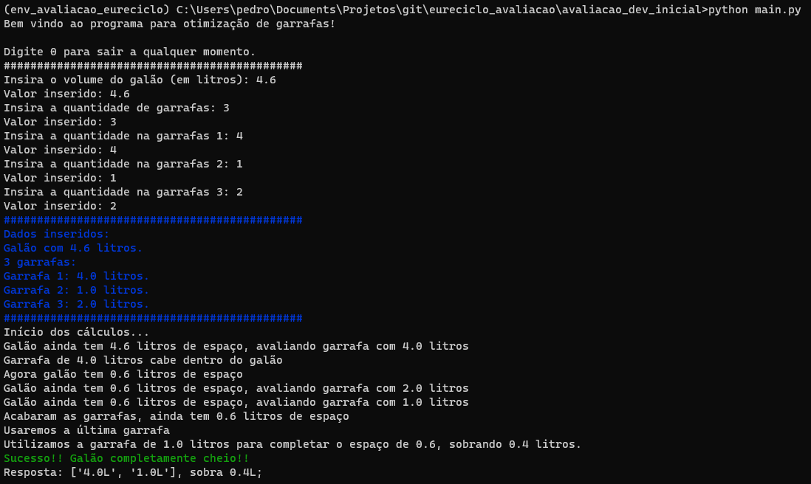
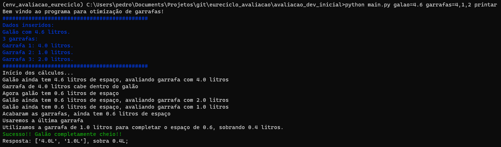
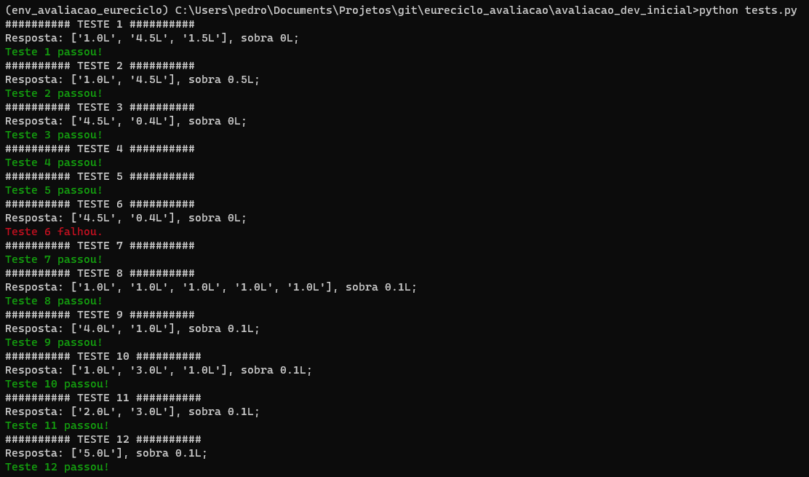

# Programa para resolver problema proposto em [enunciado](enunciado.md)

Não foi utilizado nenhuma biblioteca externa.

Complexidade de tempo: O(nlogn), pois utilizou-se heap como estrutura de dados.

## Formas de rodar
### Solicitar dados pelo prompt (rodar sem argumentos)
```
python main.py 
```


### Inserir dados como argumentos
```
python main.py galao=4.6 garrafas=4,1,2 printar
```
```
galao: capacidade do galão
garrafas: capacidade de cada garrafa
printar: se passado, printar passo-a-passo
```


## Testes
Foram desenvolvidos alguns testes no script tests.py.

O teste 6 foi propositalmente feito para não passar, para testar o comportamento do script.

```
python testes.py 
```



